# 概念
## 嵌入式系统的定义？
    以应用为中心、以计算机技术为基础、软硬件可裁剪、适应应用系统对功能、可靠性、成本、体积、功耗严格要求的专用计算机系统.

## 嵌入式系统的软、硬件组成？
    嵌入式硬件系统
        1.嵌入式处理器
        2.各种类型存储器
        3.模拟电路及电源
        4.接口控制器及接插件
###
    嵌入式软件系统
        1.实时操作系统（RTOS）
        2.板级支持包（BSP）
        3.设备驱动（Device Driver）
        4.协议栈（Protocol Stack）
        5.应用程序（Application）
###
    ARM硬件电路最小系统组成
        1.微控制器
        2.电源，时钟，复位
        3.存储器
        4.JTAG调试接口

## 处理器及操作系统的选型主要考虑哪些方面？
    功能、可靠性、成本、体积、功耗
###
    处理器选择要考虑的主要因素有：
    ① 处理器的性能 
    ② 处理器的技术指标。 
    ③ 功耗。
    ④ 软件支持工具。
    ⑤ 处理器是否内置调试工具。
    ⑥ 供应商是否提供评估板。
    ⑦ 其它因素：生产规模、开发市场的目标、软件对硬件的依赖性。
###
    操作系统的选择需要考虑到以下几个方面：
    ① 操作系统本身所提供的开发工具。
    ② 操作系统向硬件接口移植的难度。
    ③ 操作系统的内存要求。
    ④ 开发人员是否熟悉此操作系统及其提供的系统API。
    ⑤ 操作系统是否提供硬件的驱动程序，如网卡驱动程序等。
    ⑥ 操作系统的是否具有可剪裁性。
    ⑦ 操作系统的实时性能。
###
    编程语言的选择主要考虑以下因素：
    ① 通用性。
    ② 可移植性程度。
    ③ 执行效率。
    ④ 可维护性。

# 交叉开发、交叉开发环境？为何需要交叉开发环境？
## 交叉开发:
    在一台通用计算机上进行软件的编辑编译，然后下载到嵌入式设备中运行调试的开发方式。
## 交叉开发环境
    交叉开发环境是指用于嵌入式软件开发的所有工具软件的集合,交叉开发环境由宿主机和目标机组成，宿主机与目标机之间在物理连接的基础上建立起逻辑连接。
## 为何需要
    由于其本身不具备自主开发能力，即使设计完成以后，用户通常也是不能对其中的程序功能进行修改，必须有一套开发工具和环境才能进行开发。  
## 嵌入式交叉开发环境的主要组成？
        1.文本编辑器
        2.交叉编译器
        3.交叉调试器
        4.仿真器
        5.下载器等
---
## 嵌入式Linux 开发主要流程？
    1.建立开发环境
    2.配置开发主机
    3.建立引导装载程序BOOTLOADER
    4.下载别人已经移植好的LINUX 操作系统
    5.建立根文件系统
    6.建立应用程序的flash 磁盘分区
    7.开发应用程序

## 嵌入式系统开发流程
    需选改用学

## 构建嵌入式linux交叉开发环境的主要方法？
    手动编译
    用脚本编译
    下载编译好的二进制文件

## 嵌入式linux系统的软件的主要组成？及对应的主要开发工作？
    初始化引导代码               bootloader 编写
    嵌入式操作系统代码           内核编译加载
    驱动程序代码                驱动模块编写编译
    文件系统                    文件系统制作挂载
    GUI(可选)
    应用程序代码                 应用程序编写
    交叉编译环境构建

##  嵌入式 Linux  开发环境中配置 NFS 服务的目的？
    可以使不同机器、不同操作系统之间通过网络共享文件，像访问本地文件一样访问远端系统上的文件，在开发阶段，主机制作基于 NFS 的文件系统，制定开放目录，开放对象的 IP 范围，将目录挂载到嵌入式设备后，嵌入式设备可以方便地访问、修改主机主机文件。不用频繁的烧写程序代码到开发板。

## 嵌入式系统与PC之间的区别
    嵌入式系统一般是专用系统，而PC是通用计算平台
    嵌入式系统的资源比PC少得多
    嵌入式系统软件故障带来的后果比PC机大得多
    嵌入式系统一般采用实时操作系统
    嵌入式系统大都有成本、功耗的要求
    嵌入式系统得到多种微处理器体系的支持
    嵌入式系统需要专用的开发工具

## 嵌入式系统与单片机的区别
    目前嵌入式系统的主流是以32位嵌入式微处理器为核心的硬件设计和基于实时操作系统（RTOS）的软件设计
    单片机系统多为4位、8位、16位机，不适合运行操作系统，难以进行复杂的运算及处理功能
    嵌入式系统强调基于平台的设计、软硬件协同设计，单片机大多采用软硬件流水设计
    嵌入式系统设计的核心是软件设计（占70%左右的工作量），单片机系统软硬件设计所占比例基本相同

## 嵌入式系统的几个重要特征
    操作系统内核小
    专用性强
    系统精简
    高实时性OS
    嵌入式软件开发走向标准化
    嵌入式系统开发需要开发工具和环境

# ARM
## ARM硬件电路最小系统组成？
    MCU,RAM,ROM,FLASH,电源,时钟,复位
    JTAG调试接口
## ARM处理器的主要工作模式？
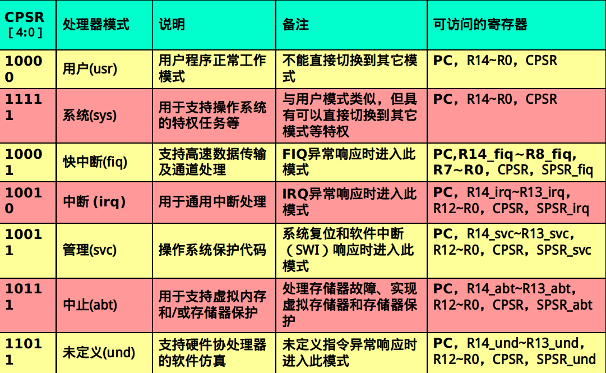
## 核心寄存器的作用：
    R13,R14,pc,cpsr,spsr
##
    R0 到 R15 可以直接访问
    R0 到 R12 是通用寄存器
##
    R13: 堆栈指针 (sp) (通常)
    每种处理器模式都有单独的堆栈,在用户应用程序的初始化部分，一般都要初始化每种模式下的R13，使其指向该运行模式的栈空间 
    Thumb中，某些指令强制性的要求使用R13作为堆栈指针 
##
    R14:子程序链接寄存器（Subroutine Link Register）或链接寄存器LR
    当执行BL子程序调用指令时，R14←R15（程序计数器PC）。
    其他情况下，R14用作通用寄存器。
    与之类似，当发生中断或异常时，对应的分组寄存器R14_svc、R14_irq、R14_fiq、R14_abt和R14_und用来保存R15的返回值。 
##
    R14为链接寄存器（LR），在结构上有两个特殊功能：
    在每种模式下，模式自身的R14版本用于保存子程序返回地址；
    当发生异常时，将R14对应的异常模式版本设置为异常返回地址（有些异常有一个小的固定偏移量）。
##
    R15 程序计数器 (PC)
    在ARM状态下，位[1:0]为0 ，在Thumb状态下，位[0]为0 。
    R15虽然也可用作通用寄存器，但一般不这么使用，否则程序的执行结果可能未知。
    对于R15的使用一定要慎重。当向R15中写入一个地址值时，程序将跳转到该地址执行。由于在ARM状态下指令总是是字对齐的，所以R15值的第0位和第1位总为0，PC［31：2］用于保存地址。
    由于ARM体系结构采用了多级流水线技术，对于ARM指令集而言，PC总是指向当前指令的下两条指令的地址，即PC的值为当前指令的地址值加8个字节。 
##
    CPSR – Current Program Status Register，当前程序状态寄存器
    CPSR可在任何运行模式下被访问，它包括条件标志位、中断禁止位、当前处理器模式标志位，以及其他一些相关的控制和状态位。
##
    5个SPSRs-- Saved  Program Status Register 程序状态保存寄存器 当异常发生时保存CPSR状态
    当异常发生时，SPSR用于保存CPSR的当前值，从异常退出时则可由SPSR来恢复CPSR。
    由于用户模式和系统模式不属于异常模式，他们没有SPSR，当在这两种模式下访问SPSR，结果是未知的。

## ARM处理器的启动程序设计？
    硬件启动程序的工作一般包括:  
        1.分配中断向量表  
        2.初始化存储器系统  
        3.初始化各工作模式下的堆栈  
        4.初始化有特殊需求的硬件模块  
        5.初始化用户程序的执行环境  
        6.切换处理器的工作模式  
        7.调用主应用程序  

## ARM启动过程
    首先， ARM 启动时的硬件机制，上电产生复位异常 ， CPU 强制 PC 为 0x00000000 ，执行复位异常处理函数，接下来就相当于执行了 startup.s的功能。是给用户程序执行给以合适的工作环境，设置中断向量表、堆栈、时钟、完成内存拷贝等，相当于 startup.s或者 bootloader 的前端代码，是开机执行的程序。拿 2410 的启动代码举例，启动 CPU 的过程是：
    1 、在起始地址分配 中断向量表 即中断处理函数（ CPU 要求的），一个向量地址只有 4 字节，所以一般只是一个跳转指令，去别处执行。在跳到 复位异常 之后，关闭中断，关闭看门狗。
    2 、之后初始化存储器系统
    3 、初始 多个模式下的堆栈 （模式切换时，硬件给 SP 置位）
    4 、初始化有特殊要求的外围设备，如 LED 灯、看门狗
    5 、初始化用户的执行环境（在 FLASH 中运行太慢了，把 代码整体搬迁 到 RAM 中）
    6 、切换处理器的工作模式
    7 、 调用主程序

## 异常处理
    当正常的程序执行流程发生暂时的停止时，称之为异常，例如处理一个外部的中断请求。在处理异常之前，当前处理器的状态必须保留，这样当异常处理完成之后，当前程序可以继续执行。处理器允许多个异常同时发生，它们将会按固定的优先级进行处理。
    异常类型
        FIQ 
        IRQ(Interrupt ReQuest)
        未定义指令
        预取中止
        数据中止
        复位
        软件中断Software interrupt

# 异常向量及异常向量表
## 异常向量
    当一种异常发生的时候，ARM处理器会跳转到对应该异常的固定地址去执行异常处理程序，而这个固定的地址，就称之为异常向量。
## 异常向量表
    由异常向量及其处理函数跳转关系组成的表即为异常向量表.

# arm处理器的异常处理流程（重点是响应与返回）
### 响应
    1、在相应的链接寄存器LR (r14)中保存下一条指令的地址，以便程序在处理异常返回时能从正确的位置重新开始行 
    2、将CPSR复制到相应的SPSR中
    3、根据异常类型，强制设置CPSR的运行模式位 
    4、强制PC从相关的异常向量地址取下一条指令执行，从而跳转到相应的异常处理程序处。
### 异常处理
    •保存断点
    – 在相应的链接寄存器LR (r14)中保存下一条指令的地址，以便程序在处理异常返回时能从正确的位置重新开始执行
    •保存现场
    – 将CPSR复制到相应的SPSR中
    •设置工作模式
    – 根据异常类型，强制设置CPSR的运行模式位
    •转向异常处理程序
    – 强制PC从相关的异常向量地址取下一条指令执行，从而跳转到相应的异常处理程序处。
    •如果异常发生时处于Thumb状态，则当异常向量地址加载
    入PC时，处理器自动切换到ARM 状态。
### 返回
    将LR寄存器中的值减去相应的偏移量送到PC中(The offset will vary depending on the type of exception)
    将 SPSR 复制回 CPSR
    清除禁止中断标志,如果它被设置成使能
    所有修改过的用户寄存器必须从处理程序的保护堆栈中恢复（即出栈）。
    可以认为程序总是从复位异常处理程序开始执行的，因此复位异常处理程序不需要返回。
### 指令实例
    STMFD  R13!，{R0，R4-R12，LR}	 ；将寄存器列表中的寄存器R0，R4到R12，LR存入堆栈。
    LDMFD R13!,{R0，R4-R12，PC} ∧ ；将堆栈内容恢复到寄存器R0，R4到R12，PC，同时SPSR复制到CPSR 
    {∧}为可选后缀，当指令为LDM且寄存器列表中包含R15，选用该后缀时表示：除了正常的数据传送之外，还将SPSR复制到CPSR。

### 对中断嵌套的处理
#
#
#
    指令示例：
    STMFD  R13!，{R0，R4-R12，LR}	 
    LDMFD  R13!，{R0，R4-R12，PC}
    LDMFD R13!,{R0，R4-R12，PC} ∧    ；
    注意条件执行相关代码
    分析startup.s相关代码
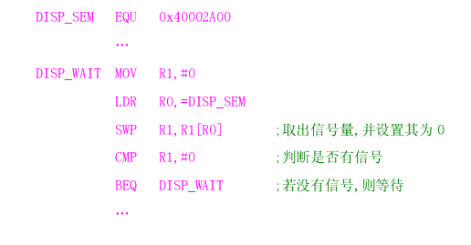

### 代码指令分析：
    AREA	Init，CODE，READONLY 
        ……
        CODE32		； 通知编译器其后的指令为32位的ARM指令
        LDR	R0，＝NEXT＋1	；将跳转地址放入寄存器R0
        BX	R0	；	 程序跳，并将处理器切换到Thumb工作状态
    ……
        CODE16		；	通知编译器其后的指令为16位的Thumb指令
    NEXT	LDR	R3，＝0x3FF	
        ……
        END					
#
## 高级语言和汇编语言函数间的相互调用 :
### 汇编调用C：
    IMPORT Main			;通知编译器该标号为一个外部标号
    AREA    Init,CODE,READONLY	；定义一个代码段
    ENTRY				；定义程序的入口点
    LDR	R0,=0x3FF0000		；初始化系统配置寄存器
    LDR	R1,=0xE7FFFF80
    STR	R1,[R0]
    LDR	SP,=0x3FE1000		；初始化用户堆栈
    BL	Main			；跳转到Main（）函数处的C/C++代码执行
    END				；标识汇编程序的结束
    以上的程序段完成一些简单的初始化，然后跳转到Main（）函数所标识的
    C/C ＋＋代码处执行主要的任务，此处的Main仅为一个标号，也可使用其他名称。

### 程序代码段的组成分析以及汇编语言的寄存器编程例如：
    标注下面程序各条语句中的含义
    AREA   Init , CODE , READONLY
    ENTRY
    LDR    R0, =0x3ff5000
    LDR    R1, 0x0f
    STR     R1,[R0]
    LDR     R0, =0x3ff5008
    LDR    R1, 0x01
    STR     R1,[R0]
    BL      PROC
    :
    :
    :
    :
    PROC
    :
    :
    MOV    PC,  LR
    :
    :
    END
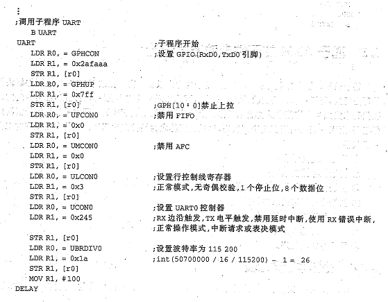
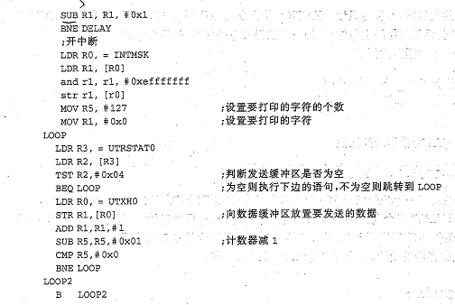

### 汇编语言程序结构
    一个汇编程序至少应该有一个代码段，当程序较长时，可以分割为多个代码段和数据段，多个段在程序编译链接时最终形成一个可执行的映象文件。
    可执行映象文件通常由以下几部分构成：
        一个或多个代码段，代码段的属性为只读。
        零个或多个包含初始化数据的数据段，数据段的属性为可读写。
        零个或多个不包含初始化数据的数据段，数据段的属性为可读写。

# 2410设计
## 总体知识：
### 阐述CPU、外设、外设控制器、时序、寄存器的相互关系？
    CPU 与外设控制器构成微控制器，微控制器在核心板（最小系统）上发挥作用，将引脚集合成外设接口加上电平转换等就是外围板，外设通过外围板 连接 至外设控制器。 CPU 通过寄存器编程控制外设控制器产生时序控制外设。若是没有外设控制器，则需要 CPU 自己产生时序来与外设交互。
    例如 若是 2410 与一个带有 IIC 接口的器件通信，只需要连接起来，对 IIC 进行寄存器编程，控制它们之间的工作模式，可能收发数据就变成了在中断中读写寄存器操作，屏蔽了 IIC 规定的通信细节。若是 51 单片机与 IIC 设备通信的话，就复杂多了，首先要仔细阅读 IIC 的协议，不容丝毫差错，然后用 IO 口模拟时序， CPU 的工作量很大。

#### Cpu如何控制外设？

#### 有外设控制器与无外设控制器CPU对外设的编程控制有何异同？

### 寄存器编程的本质？如何获取寄存器的配置？
    寄存器编程的本质是 CPU 控制外设寄存器工作模式的方法。 可以想象寄存器的每一位肯定是外设控制器功能模块中的一个个“开关”，给某一位赋值 0 或者 1 ，就相当于使能或关闭某一个功能。

## 2410:
### 2410核心电路设计？（晶振选择、启动选择、数据宽度）
    与一般的 ARM 系统相同，都需要微处理器、电源、晶振、复位、存储器（ flash 、 SDRAM ）、 JTAG 接口等，具体情况如下：（ 需要对 OM0 和 OM1 配置电平以决定启动方式，对 OM2 和 OM3 配置电平以决定时钟源 。）
    电源设计 ：处理器用 1.8V ，给时钟模块供电 1.8V ，存储器和普通 IO 用 3.3V ， ADC 模块用 3.3V ，可见最小系统最少要用 3.3 和 1.8 两种直流稳压。课程实验中电源电压 5V ，分别用 LM1085 稳压 3.3V ，用 AS1117 稳压 1.8V 。
    晶振设计
    2410 的时钟控制逻辑可以产生系统所需要的时钟，包括 CPU 的 FCLK ，和 AHB 总线的 HCLK ， APB 的 PCLK 。内部有两个锁相环 PLL ， MPLL 提供前三个， UPLL 给 USB 提供 48MHZ 的时钟。
    主时钟源（ UPLL 和 MPLL 的时钟源）可以选择是来自外部时钟还是外部晶振，这是由 OM2 和 OM3 的管脚确定的，可以 OM2 和 OM3 同时接低电平，选择外部晶振， 12M 晶振加上 15pF 起振电容（经过锁相环倍频可以达到 203M ）。
    复位电路设计
    可以在 nRESET 端设计像 51 单片机那样的阻容复位电路，但为了稳定，可以使用复位芯片如 MAX811 或 IMP811 。
    JTAG 接口设计
    有 20 针和 14 针两种 JTAG 接口。
    存储器设计
    2410 有自己的存储器控制器，并且规定了哪些 bank 空间是 RAM 哪些是 FLASH ，存储器芯片严格按照 DATASHEET 上的要求和标明的引脚连接方式与存储器控制器的存储器接口相连就可以， 控制器会根据地址产生读写存储器芯片的时序 ，完成存取数据的操作。
### 2410nor和nand启动过程分析？
    NOR flash : 读取速度高、而擦写速度低，容量小，价格高，地址线和数据线分开，采用 SRAM 接口。
    NAND flash  : 读速度不如 NORflash  但是擦写速度高，容量大，价格低，有取代硬盘的趋势，但是地址线和数据线复用，需要驱动程序配合才能读写数据。
    可以通过跳线设置时从 NAND FLASH 启动还是从 NOR FLASH 启动。
    NAND 启动的优势：便宜、容量大。但是读写逻辑不能用硬件产生，也就是没办法接到 BANK 空间里，必须有程序配合才能读写（ 有专门的控制器接口，肯定要寄存器编程加上程序配合才能读写，没有 PC 的根正苗红 ），所以理论上它是不可以用来启动系统的，因为那之前什么程序都没有，要想读写它必须是系统装载完了而且有程序了。但是三星采用了 SRAM 映射解决了这个问题，下面就是这个过程：
    电路中使 OM1 和 OM0 都接低电平，从 NAND FLASH 中启动 。（ 2410 有 NAND FLASH 控制器，连接 NAND Flash 芯片，产生读写时序）
    在该模式下， 2410 的前 4KB 地址空间对应一个名字叫做“起步石”的 SRAM ，系统启动时，自动将 NAND FLASH 的前 4KB 数据加载到起步石中，然后系统自动执行这些启动引导代码， CPU 从内部 RAM 的 0x00000000 位置开始启动。这个过程不需要程序干涉 。 也就是类似于 STARTUP.S 的功能，初始化异常向量表、堆栈、将 NAND FLASH 中的代码 ( 有代码支持喽 ) 拷贝到 SDRAM 中运行。
    NOR FLASH  采用的的是 SRAM 接口， 可以直接接到存储器控制器上， ARM 内核产生的时序能对其读写。将 bank0接上 NOR flash 芯片。上电产生复位异常后会自动从 NOR flash 中启动。
### S3C2410的中断处理流程？
    首先应该明确 2410 与 ARM 内核的异常处理系统的角色，根据之前的 ARM 异常处理流程，我们清楚了哪些是 CPU 的硬件机制。 2410 通过中断控制器允许以优先级的方式将几十个中断源共同用一个 IRQ 。一个中断申请提出后， IRQ 异常发生，切换模式、保存 CPSR 、保存 PC ，然后跳转到 handleIRQ 函数，然后跳转到 ISRIRQ( 这只是一个大概流程，也许会定义更多的跳转 ) 根据中断源向量表的首地址和偏移量寄存器找出到底是哪个中断发生了。然后跳转到相应的中断处理函数，比如跳到串口中断，还可以根据挂起位（即中断标志位）再次判断到底是接收中断还是发送完成中断。也就是说 2410 处理流程除了 ARM 对异常的响应是硬件机制外，其余的都是代码实现的。我们在编程的时候没有写的话，那也是编译器加进去的。

    2410 对嵌套的处理
    比起 2410 的处理流程不同的是，因为有了中断控制器，这就是实现高优先级嵌套的硬件基础，因为每一次进入异常模式用户都会保存环境，这就是中断嵌套的软件基础。 CPU 的异常处理机制总是那些，很明确的。我正在执行一个中断服务程序，然后再次发生异常，保存，跳转（ CPU ）、再次判断是哪个中断，进去之后压栈，运行另一个中断的服务程序，运行完返回，这是就是返回到上一个中断了。上一个中断运行完，一返回就是返回发生异常前的状态。
### S3C2410的串口、外部中断、AD等寄存器的编程能力（会读datasheet、会编程、会分析相关代码）
    ARM 的汇编语言程序 .PPT
    仔细阅读 DATASHEET ，记住 寄存器的赋值指令 。
    LDR R0 ， =GPHCON
    LDR R1,=0X2AFAAA
    STR R1 ， [R0]
### 时钟、看门狗的相关概念，pwm占空比
    时钟为整个系统提供同步脉冲，像人的脉搏一样。
    看门狗 ：其实是一个计数器，当它计数溢出的时候，会使系统复位，所以它的作用是防止系统死机和程序跑飞。打开看门狗之后，当代码跑飞或者陷入死循环之后，就不能喂狗，也就是不能清除计数值，那么它就会使系统复位重启。
### 关于时序：重点串口、I2c、spi；要求看图反推出数据，或有数据画出波形，会模拟时序编程

### 相关数据手册时序图与寄存器配置之间关系：重点LCD控制器时序、存储控制器时序、串口时序

### 重点掌握：读手册、寄存器编程、时序分析、时序编程

# VIVI
## 什么是bootloader、 Bootloader在系统中的位置、 Bootloader功能、 Bootloader操作模式 、 Bootloader启动过程
    Bootloader ，引导加载程序，是嵌入式系统加电后运行的第一段代码，相当于 PC 机的 BIOS 。  
    Bootloader 在系统中的位置
    通常固化在硬件上的某个固态存储设备上，加电后自启动。
    Bootloader 功能
    初始化硬件资源，给 CPU 合适的运行环境（相当于 STARTUP.S ），以便为最终调用操作系统内核或用户应用程序。加载内核，下载内核或者根文件系统。
    Bootloader 操作模式  
    有启动加载和下载两种模式。
    启动加载模式 是  Bootloader 的正常工作模式，在嵌入式产品发布的时侯， Bootloader 必须工作在这种模式下。即初始化 CPU 的工作环境之后，将内核加载到 RAM 执行。
    下载模式 ：
    目标机上的 Bootloader 将通过串口连接或网络连接等通信手段从主机下载文件。
    主要是下载内核映像和根文件系统映像等。从主机下载的文件通常首先被 Bootloader 保存到目标机的 RAM 中，然后再被  Bootloader 写到目标机上的 FLASH  类固态存储设备中。 Bootloader 的这种模式通常在第一次安装内核与根文件系统时被使用；此外，以后的系统更新也会使用到这种工作模式。
    Bootloader 启动过程
    上电之后，先启动 CPU 即执行 startup.s 类似功能代码（配置中断、初始化堆栈、拷贝代码等），
    然后进行加载内核的准备
    1 、至少初始化一个串口，以便向终端用户反馈数据。
    2 、检测系统内存映射，哪些是可用的 RAM ？
    在这一步之后，将检测外部按键，有按键按下将进入下载模式，没有按键的话将执行下面的步骤，加载内核：
    3 、将 kenel 和根文件系统从 flash 调入 RAM
    4 、为内核启动设置参数
    5 、调用内核。
## 相关启动代码分析

# uCos-II
## 基本概念
### 可重入函数的概念，能够识别代码是否有可重入性
    可以被一个以上的任务调用，而不必担心数据破坏。
    可重入型函数任何时候都可以被中断，一段时间以后又可以运行，而相应数据不会丢失。
    可重入型函数或者只使用局部变量，（关中断、只用局部变量、用互斥型信号量可以使函数变成可重入的）
### 剥夺型与不可剥夺型内核
    即占先式还是非占先式。
    不可剥夺 ：合作型内核，即除非自己主动放弃 CPU 的运行权，不然没办法被切换。不知道什么时候最高优先级的任务才能拿到 CPU 的控制权，完全取决于应用程序什么时候释放 CPU 。（顾名思义：每个任务不会被其它任务剥夺去，除非中断的到来，即便如此，当中断结束后，还是会回到原来被中断的程序，而不会切换到具有高优先级的任务中去。）
    可剥夺 ：最高优先级的任务一旦就绪，总能得到 CPU 的控制权。可以被挂起，可以再中断退出时失去对 CPU 的运行权。
    使用占先式内核时，应用程序不应直接使用不可重入型函数
    非占先式内核的一个特点是几乎不需要使用信号量保护共享数据。运行着的任务占有 CPU ，而不必担心被别的任务抢占，什么时候释放，自己说了算。
    可剥夺型的内核是实时系统所必须的。 即实时不在于立即，而在于可预测性，高优先级得到 CPU 的时刻是可以预测的。
### 进程上下文
    是进程运行寄存器环境的总和：对 arm 而言， R0-R12,SP,LR,PC ， CPSR ， SPSR 。
    STMFD  sp!, {pc}    ; save pc
    STMFD  sp!, {lr}    ; save lr
    STMFD  sp!, {r0-r12}    ; save registers and ret address
    MRS    r4, CPSR
    STMFD  sp!, {r4}    ; save CPSR
    MRS    r4, SPSR  
    STMFD  sp!, {r4}    ; save SPSR
### 实时系统本质是：可预测性

### 内核的相关知识
    初始化 ： OSInit (); 系统初始化，创建系统任务、创建链表，等待将 TCB 赋值后放进去。
    启动 ： OSStart();  就是在就绪态的任务中找到优先级最高的出栈运行，调用 OSStartHighRdy() 。
    ( 在启动之前要调用 OS_Taskcreat （），规定一创建就进入就绪态（初始化就绪态表）它一定是对 TCB 赋值 ( 调用 TCBinit ）放到链表里，从空闲链表头取一个链表，放在使用链表里。 )
### uCos-II的任务切换

### 临界区的概念
    代码的临界区: 处理时不可分割的代码。一旦这部分代码开始执行，则不允许任何中断打入。

    在进入临界区之前要关中断，而临界区代码执行完以后要立即开中断（在任务切换时，地址、指令、数据等寄存器堆栈保护）。

### 实时系统的概念
    系统内有多个程序运行，每个程序有不同的优先级，只有最高优先级的任务才能占有CPU的控制权。
    实时操作系统（RTOS）是指当外界事件或数据产生时，能够接受并以足够快的速度予以处理，其处理的结果又能在规定的时间之内来控制生产过程或对处理系统做出快速响应，调度一切可利用的资源完成实时任务，并控制所有实时任务协调一致运行的操作系统。
## uCos-II内核的相关知识
### 互斥条件
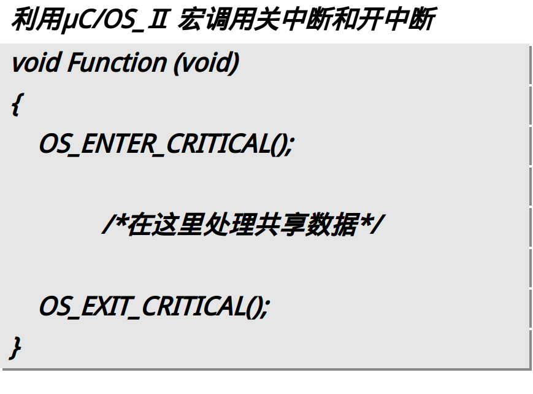
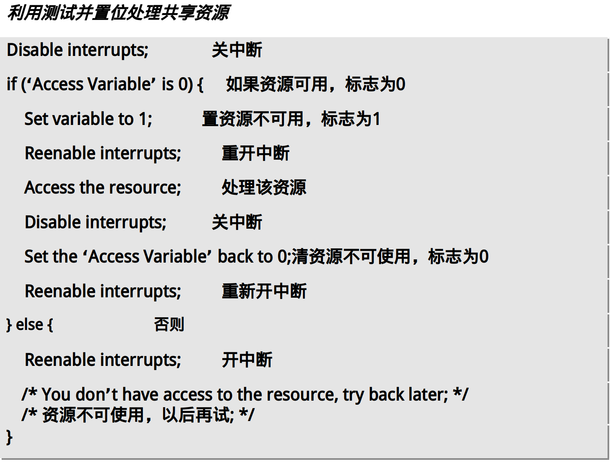
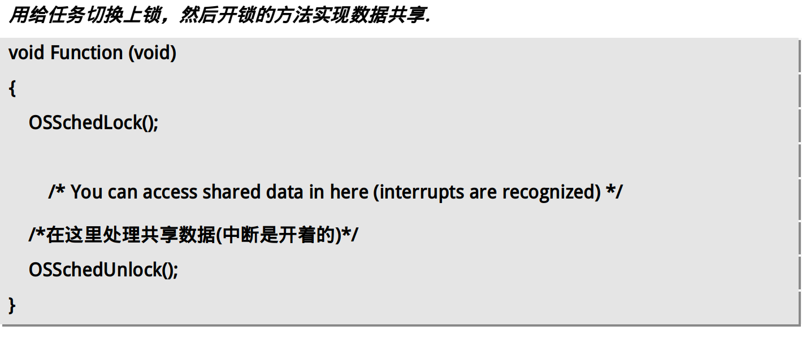

### 初始化、启动
    OSInit ( )：主要功能
    完成一般变量初始化
    就绪列表初始化
    空闲任务键表OSTCBFreeList建立
    事件空闲键表OSEventFreeList建立
    其它相关功能参数初始化。
    创建空闲任务OS_TaskIdle
    创建统计任务OS_InitTaskSta
    
    OSStart()主要功能：
    获得优先级最高的就绪任务；
    启动优先级最高的就绪任务。OSStartHighRdy();

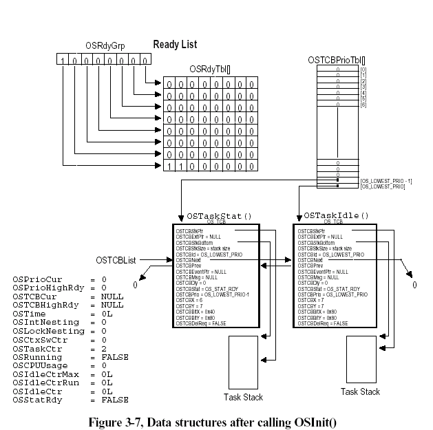

### 任务组成、状态、任务的调度、任务的切换、优先级管理、中断退出
任务组成：  
    任务控制块用来保存任务属性
    任务的栈用来保存任务的工作环境
    任务代码程序执行部分
状态:
    睡眠态、就绪态、运行态、等待态、中断服务态  
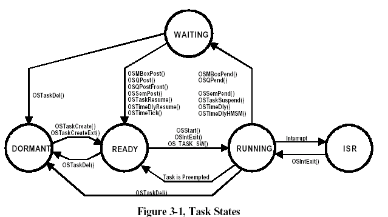
任务调度:查表法
    每时每刻总是让优先级最高的就绪任务处于运行状态；为保证这一点它在系统或用户任务调用系统函数及执行中断服务程序结束时，总是调用调度器来确定应该运行的任务并运行它。  
    针对就绪表的三种操作：  
        使任务进入就绪态  
        使任务脱离就绪态  
        根据就绪表确定最高优先级  

### 任务的几个特征：
    任务通常是一个无限的循环
    返回参数类型必须定义成void(当任务开始执行时，可以有一个参数传递给用户任务代码）
    也可以使用while(1)语句，实现无限的循环；任务可以有返回值类型和参数，但任务函数永远不会返回。
    任务完成后，任务可以自我删除。

### 任务控制块
    任务控制块 OS_TCB是一个数据结构，保存该任务的相关参数，包括任务堆栈指针，状态，优先级，任务就绪表位置，任务链表指针等。
    当任务重新得到CPU使用权时，任务控制块能确保任务从当时被中断的哪一点丝毫不差的继续执行。
    所有的任务控制块分为两条链表，空闲链表和使用链表。
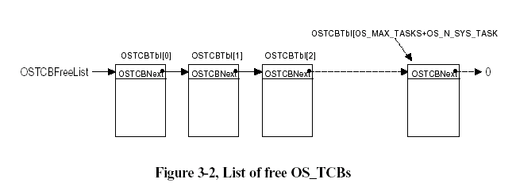

### 时间管理内核代码分析
### 移植代码分析:
    定义函数OS_ENTER_CRITICAL和OS_ EXIT _CRITICAL。
    定义函数OS_TASK_SW执行任务切换。（包含OSCtxSw） 
    定义函数OSCtxSw实现用户级上下文切换，用纯汇编实现。 
    定义函数OSIntCtxSw实现中断级任务切换，用纯汇编实现。 
    定义函数OSTickISR。 
    定义OSTaskStkInit来初始化任务的堆栈。 

### 执行uCos-II初始化后系统内核的主要数据结构？
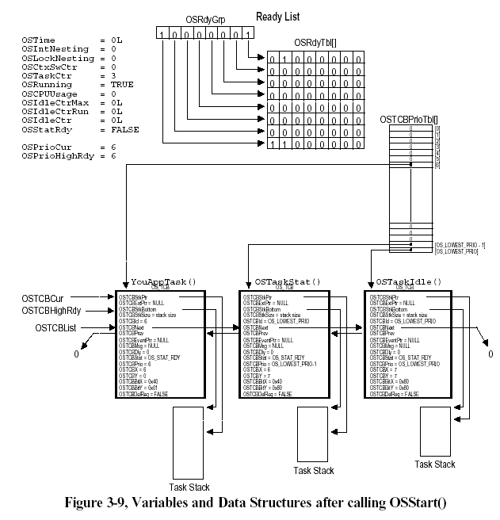
### 简述任务的创建过程？
当应用程序调用函数OSTaskCreate()创建一个任务时，这个函数会调用系统函数OSTCBInit( )来为任务控制块进行初始化。
OSTaskCreate()具体过程:
1.判断优先级范围是否越界
2.关中断
3.根据优先级设置优先级列表OSTCBPrioTbl
4.开中断
5.初始化栈
6.初始化TCB控制块OSTCBInit( )
7.关中断
8.任务统计+1
9.开中断
10.任务调度
任务建立后，空任务控制块指针OSTCBFreeList指向的任务控制块就赋给了该任务，然后OSTCBFreeList的值调整为指向链表中的下一个空任务控制块。
系统函数OSTCBInit( )的功能：
    为被创建任务从空任务控制块链表获取一个任务控制块；
    用任务属性对任务控制块各个成员进行赋值；
    把赋值的任务控制块链入到任务控制块链表的头部。
    修改Ready List对应位

### 任务控制块列表数组OSTCBTBL[ ]与OSTCBPrioTBL[ ]的区别？
    OSTCBTBL[]:存放空闲TCB
    OSTCBPrioTBL[]:专门用来以任务的优先级为顺序，在数组的元素里存放指向各个任务控制块的指针。

##  Task scheduler
    void OS_Sched (void)    /*os_core.c中*/
    {
        INT8U y;
        OS_ENTER_CRITICAL(); 
        if ((OSLockNesting =0)&&(OSIntNesting= 0)) {	
            y = OSUnMapTbl[OSRdyGrp];获得最高优先级的高三位	
                        OSPrioHighRdy = (INT8U)((y << 3) + OSUnMapTbl[OSRdyTbl[y]]) 
            if (OSPrioHighRdy != OSPrioCur) {	
                OSTCBHighRdy=OSTCBPrioTbl[OSPrioHighRdy];
                OSCtxSwCtr++;	
                OS_TASK_SW();	
            }
        }
        OS_EXIT_CRITICAL();
    }
    全局变量OSIntNesting判断是否还有中断
    全局变量OSLockNesting判断是否给调度器上锁
## 任务切换OS_TASK_SW()的示意性代码
    OS_CPU.H
    #define  OS_TASK_SW()         OSCtxSw()

    Void OSCtxSw(void)
    {
        将R1,R2,R3及R4推入当前堆栈；
        OSTCBCurOSTCBStkPtr = SP;
        OSTCBCur              = OSTCBHighRdy;
        SP                    = OSTCBHighRdy OSTCBSTKPtr;
        将R4,R3,R2及R1从新堆栈中弹出；
        执行中断返回指令；
    }
#
    ;	void OS_TASK_SW(void)     /任务：保存当前任务上下文，装入新任务上下文 /
    ;	
    ;	Perform a context switch.
    ;
    ;	On entry, OSTCBCur and OSPrioCur hold the current TCB and priority
    ;	and OSTCBHighRdy and OSPrioHighRdy contain the same for the task
    ;	to be switched to.

    OS_TASK_SW
        STMFD	sp!, {lr}		; save pc
        STMFD	sp!, {lr}		; save lr
        STMFD	sp!, {r0-r12}		; save registers and ret address
        MRS		r4, CPSR
        STMFD	sp!, {r4}		; save current PSR
        MRS		r4, SPSR	
        STMFD	sp!, {r4}		; save SPSR

        ; OSPrioCur = OSPrioHighRdy
        LDR	r4, addr_OSPrioCur
        LDR	r5, addr_OSPrioHighRdy
        LDRB	r6, [r5]              ;优先级仅为一个字节
        STRB	r6, [r4]
        
        ; Get current task TCB address
        LDR	r4, addr_OSTCBCur
        LDR	r5, [r4]
        STR	sp, [r5]		; store sp in preempted tasks's TCB

        ; Get highest priority task TCB address
        LDR	r6, addr_OSTCBHighRdy
        LDR	r6, [r6]
        LDR	sp, [r6]		; get new task's stack pointer

        ; OSTCBCur = OSTCBHighRdy
        STR	r6, [r4]		; set new current task TCB address

    ; restore task's mode regsiters
        LDMFD	sp!, {r4}
        MSR	SPSR, r4
        LDMFD	sp!, {r4}
        MSR	CPSR, r4

    ; return in new task context
        LDMFD	sp!, {r0-r12, lr, pc}
